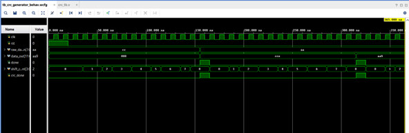
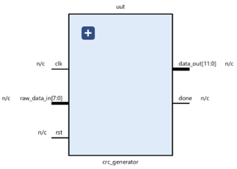
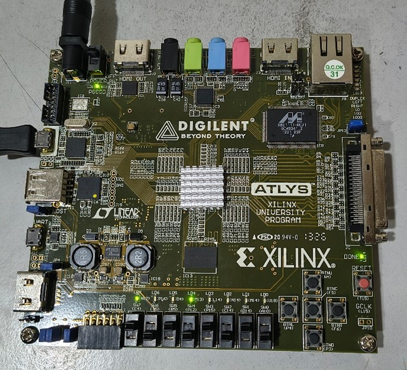

# CRC-4 Generator and Checker (Verilog | FPGA)

## 📌 Overview

This project implements a CRC-4 encoder and decoder using Verilog HDL.  
The design is fully synthesizable and verified using simulation testbenches.  
The module was also targeted for FPGA implementation (Spartan-6).

CRC (Cyclic Redundancy Check) is widely used in digital communication systems
for error detection in data transmission.

---

## 🎯 Objectives

- Implement CRC-4 generator using polynomial division
- Design CRC checker to detect transmission errors
- Verify functionality using simulation
- Synthesize and deploy on FPGA
- Understand hardware-based error detection mechanisms

---

## 🧮 CRC Polynomial Used

Generator Polynomial:

G(x) = x⁴ + x + 1

Binary Representation:
10011

---

## 🏗️ Architecture

The system consists of:

1. CRC Generator (Transmitter Side)
2. CRC Checker (Receiver Side)
3. Testbench for functional verification

### Transmitter Flow:
- Input data is appended with 4 zeros
- Polynomial division performed using shift-register logic
- Remainder appended to original data
- Transmitted frame = Data + CRC bits

### Receiver Flow:
- Received frame divided by same polynomial
- If remainder = 0000 → No error detected
- Else → Error detected

---

## 🔧 Design Details

### CRC Generator
- Implemented using shift-register based XOR logic
- Sequential design
- Parameterized data width

### CRC Checker
- Uses identical polynomial
- Outputs error flag if remainder ≠ 0

---

## 🧪 Simulation & Verification

- Testbench applies multiple test vectors
- Valid and invalid frames tested
- Waveforms verified using Vivado Simulator
- Error detection validated for corrupted inputs

### Example Test Case

| Input Data | Transmitted Frame | Error Introduced | Error Detected |
|------------|------------------|------------------|---------------|
| 110101     | 110101xxxx       | No               | No            |
| 110101     | Modified bit     | Yes              | Yes           |

---

## 💻 Tools Used

- Verilog HDL
- Xilinx Vivado
- Spartan-6 FPGA

---

## 🚀 FPGA Implementation

- Synthesized in Vivado
- Mapped to Spartan-6 board
- Verified functionality using on-board I/O

---

## 📊 Learning Outcomes

- Polynomial division in hardware
- Shift register implementation
- Error detection logic
- RTL simulation and debugging
- FPGA synthesis flow

---

## 📈 Simulation Waveform

---

## RTL schematic

---
## Implementation in spartan-6 FPGA

## 🔮 Future Improvements

- Parameterized CRC width (CRC-8, CRC-16, CRC-32)
- Parallel CRC architecture for high-speed systems
- AXI-stream interface integration
- Functional coverage-based verification

---

## 👨‍💻 Author

Pilla Chandra Sekhar  
M.Tech VLSI | RTL & Processor Design Enthusiast